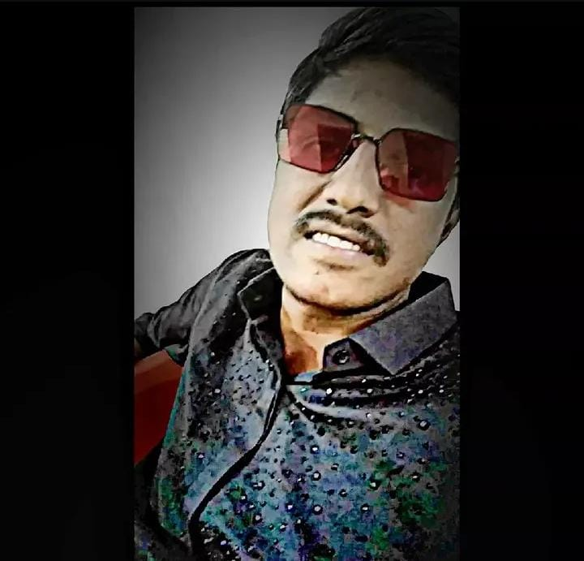
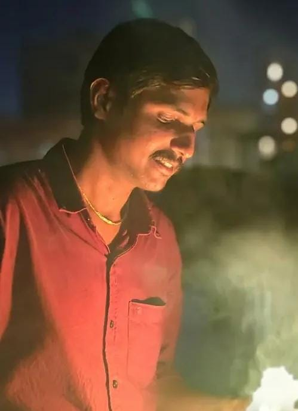
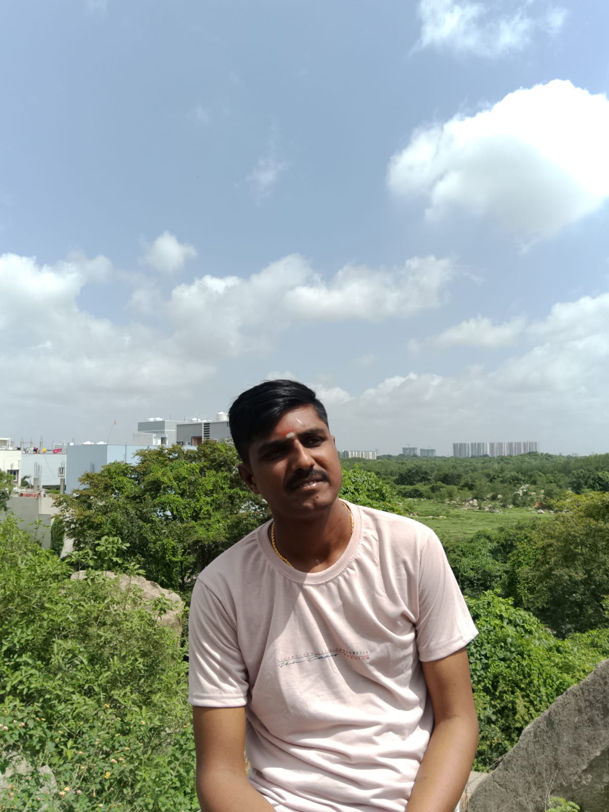
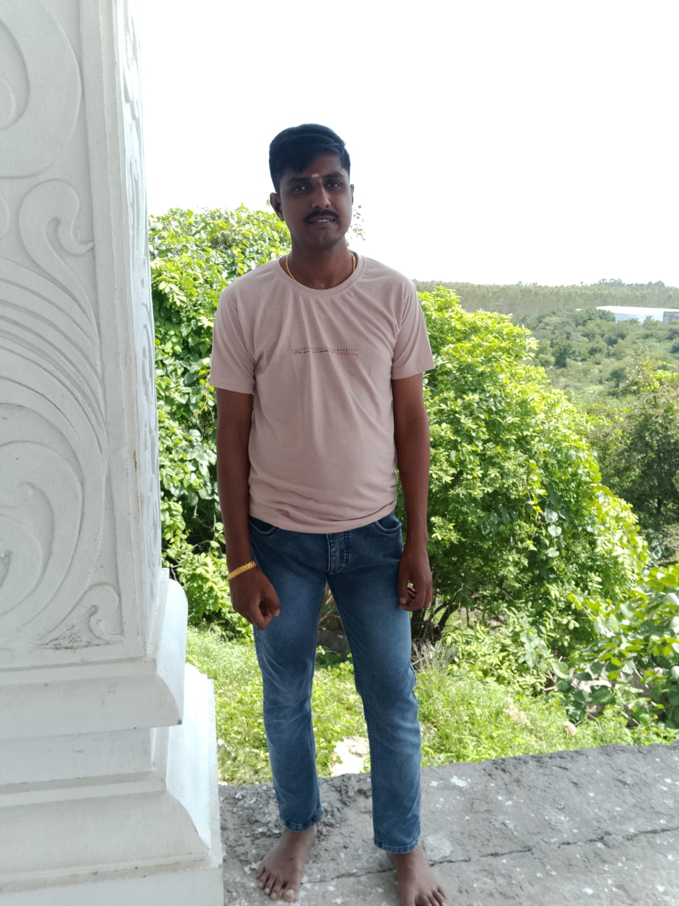
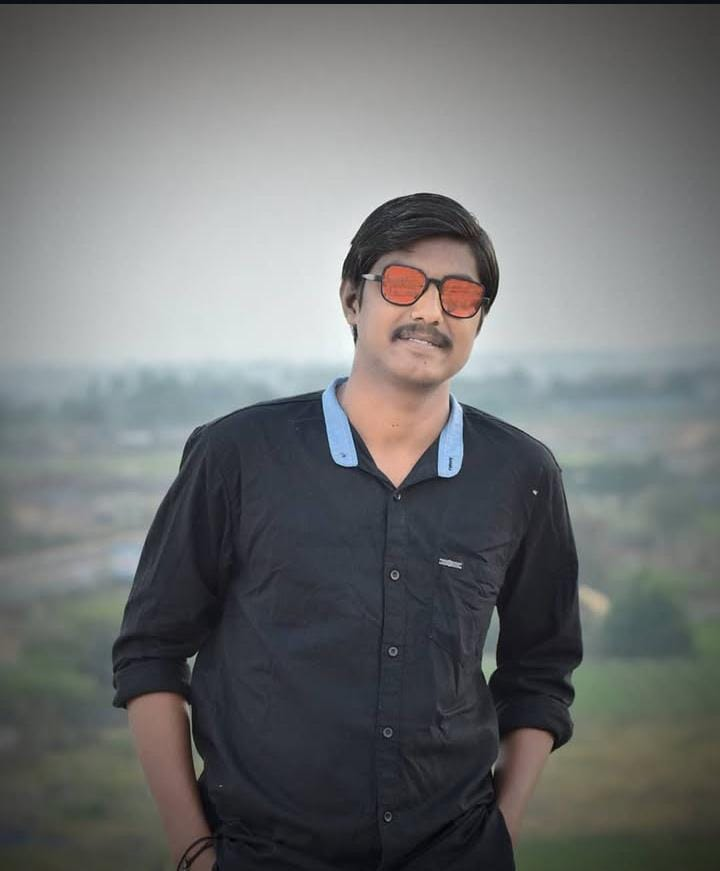

<!DOCTYPE html>
<html lang="en">
<head>
  <meta charset="UTF-8">
  <meta name="viewport" content="width=device-width, initial-scale=1.0, maximum-scale=1.0, user-scalable=yes, viewport-fit=cover">
  <meta name="theme-color" content="#0b0d10">
  <meta name="apple-mobile-web-app-capable" content="yes">
  <meta name="apple-mobile-web-app-status-bar-style" content="black-translucent">
  <meta name="apple-mobile-web-app-title" content="Rajkumar">
  <title>Muddasani Rajkumar · Actor & Assistant Director</title>
  <link rel="preconnect" href="https://fonts.googleapis.com">
  <link rel="preconnect" href="https://fonts.gstatic.com" crossorigin>
  <link href="https://fonts.googleapis.com/css2?family=Inter:opsz,wght@14..32,300..700&display=swap" rel="stylesheet">
  <link rel="stylesheet" href="https://cdnjs.cloudflare.com/ajax/libs/font-awesome/6.0.0-beta3/css/all.min.css">
  
</head>
<body>
  

    <header class="portfolio-header">
      

        
      

      

        <h1>Muddasani Rajkumar</h1>
        
<i class="fas fa-film"></i> Artist / Assistant Director

        

          <i class="fas fa-calendar-alt"></i> Age: 26
          <i class="fas fa-ruler-vertical"></i> Height: 6'5"
          <i class="fas fa-map-pin"></i> Hyderabad
          <i class="fas fa-phone-alt"></i> 9391271361
        

      

    </header>

    <h2 class="section-title"><i class="fas fa-user-circle"></i> About</h2>
    

      
<i class="fas fa-quote-left"></i> I am very passionate about acting and assistant directing. When I saw the movie <strong>"Emayachesave"</strong> with Samantha and Chaithanya sir, it deeply inspired me. I started working with small content on TikTok from 2019–2021, where I had good reach with acting videos. I also taught my sister's son acting — how to perform in the real world and in front of the camera.

      
<i class="fas fa-heart"></i> I am passionate about acting and assistant direction. I definitely believe that I will get an opportunity from you. Thank you.

    

    <h2 class="section-title"><i class="fas fa-images"></i> Gallery</h2>
    

      

      

      

      

      

      

    

    <h2 class="section-title"><i class="fas fa-paper-plane"></i> Reach Out</h2>
    

      

        
<i class="fas fa-user"></i> Muddasani Rajkumar

        
<i class="fas fa-map-marker-alt"></i> Hyderabad

        
<i class="fas fa-ruler-vertical"></i> 6'5"

        
<i class="fas fa-cake-candles"></i> 26 yrs

      

      <a href="tel:+919391271361" class="contact-highlight"><i class="fas fa-phone-alt"></i> 9391271361</a>
    

    

      <i class="fas fa-star"></i>
      Muddasani Rajkumar · Actor & Assistant Director · Hyderabad
    

  

  

    ✕
    
  

  
</body>
</html>
